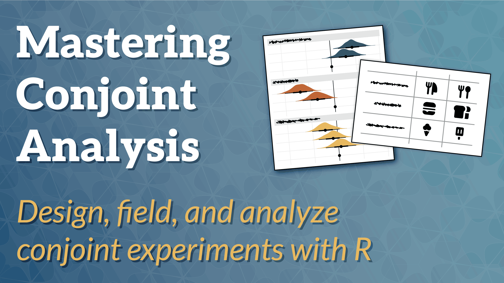

## Overview

Conjoint experiments have become a popular tool in both social science and marketing research for understanding how people make decisions and what attributes matter most in their choices. Originally developed by marketers to measure consumer preferences for new products, conjoint analysis has expanded into political science, economics, sociology, and other fields as a powerful method for testing multiple causal effects simultaneously and eliciting respondent preferences. With a single well-designed survey, you can answer complex research questions about decision-making that would require dozens of traditional experiments.

In this course, you'll learn the theory behind forced choice conjoint experiments, how to design studies that answer your research questions, how to program and field these survey experiments in online platforms, and how to analyze and visualize the results using open source tools like R, Quarto, {marginaleffects}, and {ggplot2}. You'll explore key causal estimands like average marginal component effects (AMCEs) and marginal means (MMs), as well as preference-focused measures like part-worth utilities and willingness-to-pay. By the end of the course, you'll be able to design and field your own conjoint experiments, analyze the results with appropriate methods, and communicate your findings effectively with publication-ready tables and figures.

## Schedule

All times are US Eastern (New York) time:

```{r}
#| label: schedule-table
#| warning: false
#| message: false
#| echo: false

library(tinytable)
library(dplyr)
library(glue)

# To keep {tinytable} happy
set.seed(1234)

# fmt: skip
schedule <- tribble(
  ~Day,             ~Time,         ~Title,                                                     ~Link,
  "Day 1 (June 2)", "10:30–12:30", "Introduction to conjoint analysis",                        "/materials/intro/",
  "Day 1 (June 2)", "12:30–13:30", "*Break*",                                                  NA,
  "Day 1 (June 2)", "13:30–15:00", "Designing conjoint experiments",                           "/materials/designing/",
  "Day 2 (June 3)", "10:30–12:30", "Analyzing conjoint data for causal inference (§ 1)",       "/materials/causal-inference/",
  "Day 2 (June 3)", "12:30–13:30", "*Break*",                                                  NA,
  "Day 2 (June 3)", "13:30–15:00", "Analyzing conjoint data for causal inference (§ 2)",       "/materials/causal-inference/",
  "Day 3 (June 4)", "10:30–12:30", "Analyzing conjoint data for respondent preferences (§ 1)", "/materials/preferences/",
  "Day 3 (June 4)", "12:30–13:30", "*Break*",                                                  NA,
  "Day 3 (June 4)", "13:30–15:00", "Analyzing conjoint data for respondent preferences (§ 2)", "/materials/preferences/",
  "Day 4 (June 5)", "10:30–12:30", "Implementing and fielding conjoint surveys (§ 1)",         "/materials/implementing/",
  "Day 4 (June 5)", "12:30–13:30", "*Break*",                                                  NA,
  "Day 4 (June 5)", "13:30–15:00", "Implementing and fielding conjoint surveys (§ 2)",         "/materials/implementing/"
) |> 
  mutate(Content = ifelse(is.na(Link), Title, glue('[{Title}]({Link}){{target="_blank"}}')))

schedule |>
  select(Time, Content) |>
  tt(colnames = FALSE) |>
  theme_empty() |>
  group_tt(i = schedule$Day) |>
  style_tt(i = "groupi", align = "l", bold = TRUE, background = "#dddddd") |>
  style_tt(i = "~groupi", j = 1, indent = 1) |>
  format_tt(j = 2, markdown = TRUE) |>
  theme_html(engine = "bootstrap", class = "table table-sm")
```

## Instructor

[Andrew Heiss](https://www.andrewheiss.com/) is an assistant professor in the Department of Public Management and Policy at the Andrew Young School of Policy Studies at Georgia State University. His research explores human rights and international nonprofit management, and focuses on authoritarian regulation of civil society and INGO responses to administrative crackdown. Heiss also studies and teaches quantitative research methods, causal inference, data visualization, and Bayesian analysis. He is an RStudio Certified Instructor whose work has appeared in journals such as the *Journal of Politics*, *Nonprofit and Voluntary Sector Quarterly*, the *Journal of Statistical Software*, the *Journal of Human Rights*, and *International Interactions*.
