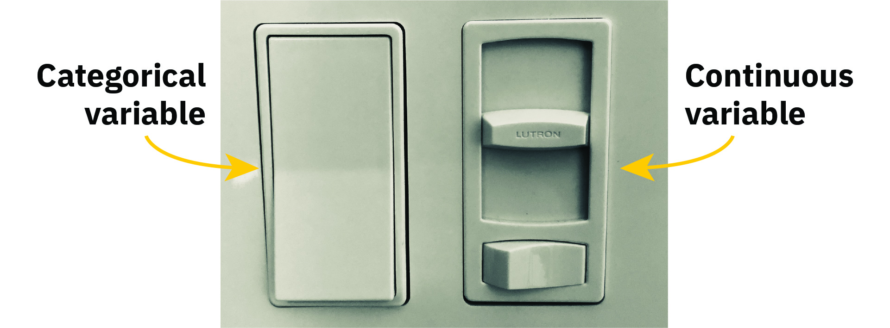
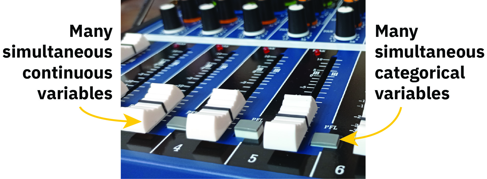
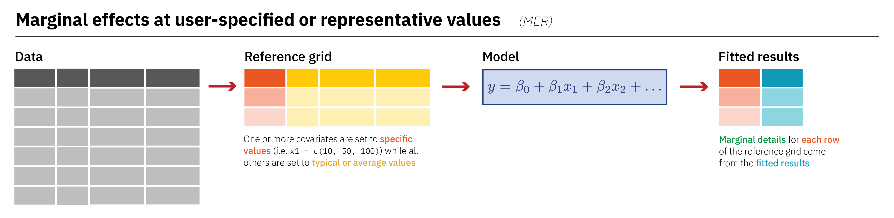

```{r}
#| include: false

library(countdown)
library(tinytable)

options(
  parameters_cimethod = FALSE,
  parameters_exponentiate = FALSE,
  width = 1000
)
```

# Sliders and switches {background-color='' background-image='../../img/background-hex-shapes.svg' background-opacity='0.5'}

## 

\ 

{fig-align="center" width="100%" style="box-shadow: 5px 5px 15px rgba(0, 0, 0, 0.3); border-radius: 5px;"}

## 

\ 

{fig-align="center" width="100%" style="box-shadow: 5px 5px 15px rgba(0, 0, 0, 0.3); border-radius: 5px;"}

##


```{r}
#| warning: false
#| message: false
#| echo: true

library(tidyverse)
library(marginaleffects)
library(parameters)

penguins <- penguins |> drop_na(sex)

model1 <- lm(body_mass ~ flipper_len, data = penguins)
model2 <- lm(body_mass ~ flipper_len + species, data = penguins)
```

. . .

\ 
```{r}
#| echo: true
model_parameters(model1)
```

. . .

\ 

```{r}
#| echo: true
model_parameters(model2)
```

## {marginaleffects}

::: {.box}
Quit working with raw coefficients!
:::

::: {.text-tiny}
Arel-Bundock, Vincent, Noah Greifer, and Andrew Heiss. 2024. “How to Interpret Statistical Models Using marginaleffects for R and Python.” Journal of Statistical Software 111 (9): 1–32. <https://doi.org/10.18637/jss.v111.i09>.

Arel-Bundock, Vincent. 2026. Model to Meaning: How to Interpret Statistical Models with R and Python. A Chapman & Hall Book. CRC Press, Taylor & Francis Group. <https://doi.org/10.1201/9781003560333>, <https://marginaleffects.com/>
:::

{fig-align="center" width="100%" style="box-shadow: 5px 5px 15px rgba(0, 0, 0, 0.3); border-radius: 5px;"}

##

1. **Quantity**: What is the quantity of interest? Do we want to report a prediction or a function of predictions (average, difference, ratio, derivative, etc.)?
2. **Grid**: What predictor values are we interested in? Do we want to report estimates for the units in our dataset, or for hypothetical or representative individuals?
3. **Aggregation**: Do we report estimates for every observation in the grid or a global summary?
4. **Uncertainty**: How do we quantify uncertainty about our estimates?
5. **Test**: Which (non-)linear hypothesis or equivalence tests do we conduct?

##

```{r}
#| echo: true
model_parameters(model1)
```

. . . 

\ 

```{r}
#| echo: true
avg_comparisons(model1)
```

##

```{r}
#| echo: true
model_parameters(model2)
```

. . . 

\ 

```{r}
#| echo: true
avg_comparisons(model2)
```

##

```{r}
#| echo: true
model3 <-lm(body_mass ~ flipper_len * species, data = penguins)
model_parameters(model3)
avg_comparisons(model3, by = "species")
```

##

```{r}
#| echo: true
#| out-width: "100%"
plot_predictions(model3, condition = c("flipper_len", "species"))
```

# What are marginal means? {background-color='' background-image='../../img/background-hex-shapes.svg' background-opacity='0.5'}

## OLS with categorical predictors

```{r}
#| warning: false
#| message: false
#| echo: true

model <- lm(body_mass ~ species + sex, data = penguins)
```

## Predictions across balanced grid

```{r}
#| echo: true
grid <- datagrid(model = model, species = unique, sex = unique)

preds <- predictions(model, grid)
```

\ 

:::: {.columns}

::: {.column .fragment}

```{r}
#| echo: true
preds |> 
  as_tibble() |> 
  select(species, sex, estimate)
```

:::

::: {.column .fragment}

```{r}
preds |> 
  select(estimate, Species = species, sex) |> 
  pivot_wider(names_from = sex, values_from = estimate) |> 
  rename(Female = female, Male = male) |> 
  tt() |>
  group_tt(j = list("Sex" = 2:3)) |> 
  format_tt(digits = 1) |> 
  style_tt(j = 1:3, align = "lcc") |> 
  style_tt(i = -1:0, bold = TRUE)
```

:::

::::


## Means in the margins

```{r}
mean_species <- preds |> 
  summarize(avg_estimate = mean(estimate), .by = species)

mean_sex <- preds |> 
  mutate(avg_estimate = mean(estimate), .by = sex) |> 
  select(species, sex, estimate, avg_estimate) |> 
  pivot_wider(names_from = species, values_from = estimate) |> 
  mutate(avg_explanation = str_glue(
    "{round(avg_estimate, 0)}<br><span style='font-size:60%'>({round(Adelie, 0)} + {round(Chinstrap, 0)} + {round(Gentoo, 0)}) / 3</span>"
  )) |> 
  select(sex, avg_explanation) |> 
  mutate(species = "<strong>Marginal mean</strong>") |> 
  pivot_wider(names_from = sex, values_from = avg_explanation)

mms_table <- preds |> 
  select(estimate, species, sex) |> 
  pivot_wider(names_from = sex, values_from = estimate) |> 
  left_join(mean_species, by = join_by(species)) |> 
  arrange(species) |> 
  mutate(avg_explanation = glue::glue(
    "{round(avg_estimate, 0)}<br><span style='font-size:60%'>({round(female, 0)} + {round(male, 0)}) / 2</span>"
  )) |> 
  mutate(across(c(female, male), ~as.character(round(., 0)))) |> 
  bind_rows(mean_sex) |> 
  select(Species = species, Female = female, Male = male, `Marginal mean` = avg_explanation)
  
mms_table |> 
  tt() |> 
  group_tt(j = list("Sex" = 2:3)) |> 
  format_tt(replace = "") |> 
  style_tt(align = "lccc", fontsize = 0.85) |> 
  style_tt(i = -1:0, bold = TRUE) |> 
  style_tt(j = 4, line = "l", line_width = 0.05) |> 
  style_tt(i = 4, line = "t", line_width = 0.05)
```

::: {.box style="font-size: 0.7em;"}
For the sex-specific averages, all the between-species variation is "marginalized out" or accounted for; for the species-specific averages, all the between-sex variation is similarly marginalized out.
:::

## Differences in marginal means

```{r}
diff_mean_species <- preds |>
  summarize(avg_estimate = mean(estimate), .by = species) |>
  mutate(diff = avg_estimate - avg_estimate[species == "Adelie"]) |>
  mutate(
    diff_explanation = case_when(
      species == "Adelie" ~ "—",
      .default = str_glue(
        "{round(diff, 0)}<br><span style='font-size:60%'>{species}−Adelie</span>"
      )
    )
  ) |>
  select(Species = species, `∆` = diff_explanation)

diff_mean_sex <- preds |>
  summarize(avg_estimate = mean(estimate), .by = sex) |>
  mutate(diff = avg_estimate - avg_estimate[sex == "female"]) |> 
  mutate(
    diff_explanation = case_when(
      sex == "female" ~ "—",
      .default = str_glue(
        "{round(diff, 0)}<br><span style='font-size:60%'>{str_to_sentence(sex)}−Female</span>"
      )
    )
  ) |>
  select(sex, diff_explanation) |> 
  pivot_wider(names_from = sex, values_from = diff_explanation) |> 
  select(Female = female, Male = male) |> 
  mutate(Species = "<strong>∆</strong>")

mms_table |> 
  left_join(diff_mean_species, by = join_by(Species)) |> 
  bind_rows(diff_mean_sex) |> 
  tt() |> 
  group_tt(j = list("Sex" = 2:3)) |> 
  format_tt(replace = "") |> 
  style_tt(align = "lcccc", fontsize = 0.85) |> 
  style_tt(i = -1:0, bold = TRUE) |> 
  style_tt(j = 4, line = "l", line_width = 0.05) |> 
  style_tt(i = 4, line = "t", line_width = 0.05)
```

## Coefficients and predictions

```{r}
#| echo: true
parameters::model_parameters(model)
```

```{r}
#| echo: true
avg_predictions(model, by = "species", newdata = "balanced")
avg_predictions(model, by = "sex", newdata = "balanced")
```
