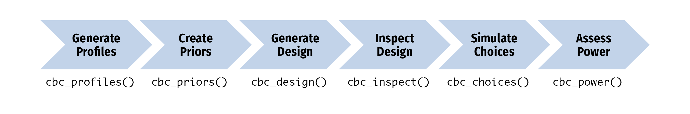

## Slides

No slides for this one! But we will use these: 

- [Statistical testing in null worlds](https://nullworlds.andrewheiss.com/)
- [{cbcTools}](https://jhelvy.github.io/cbcTools/)

## Exercises and materials

Make sure you [grab the latest version of the workshop materials](https://github.com/andrewheiss/mastering-conjoint-analysis-materials_2026-06) first!
