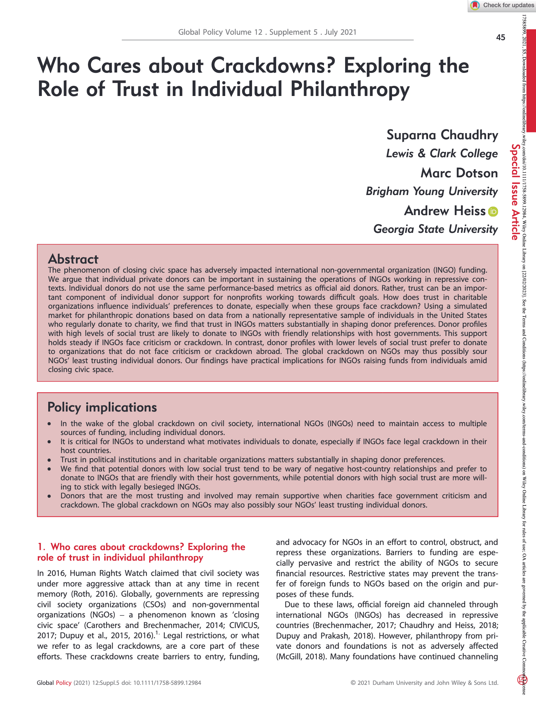
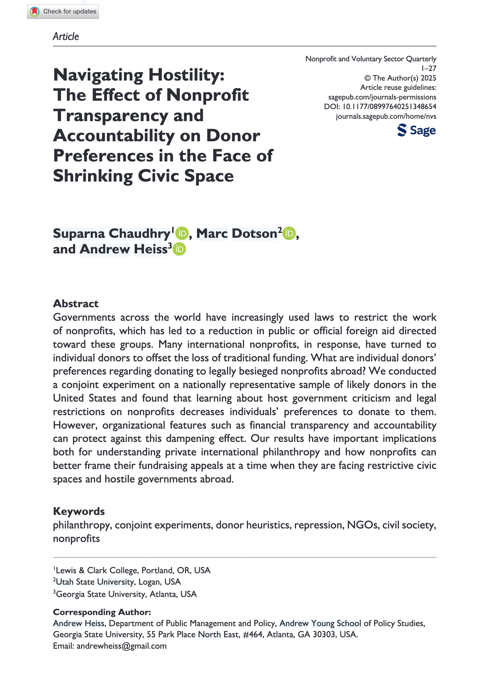
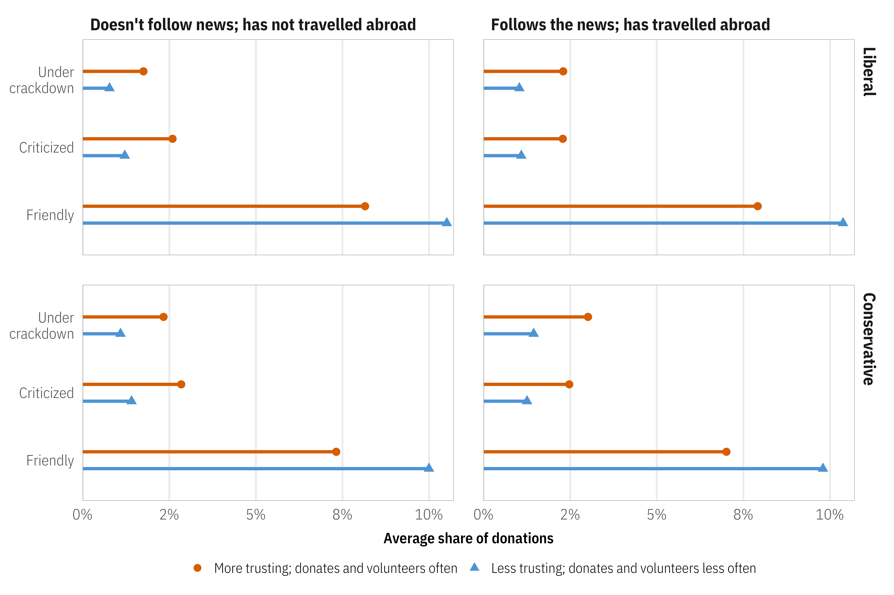
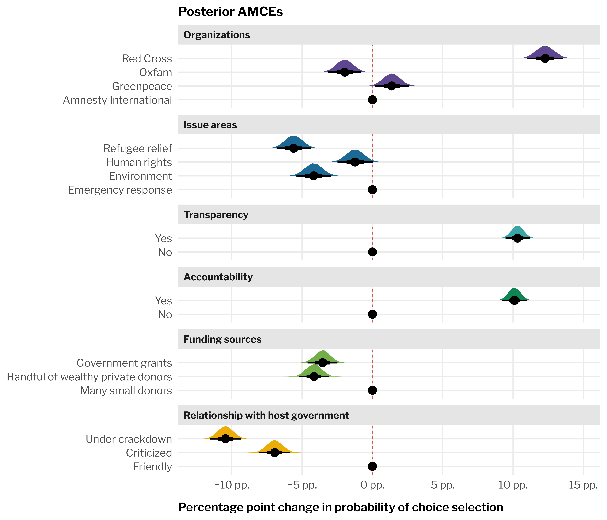

# What can we estimate with it? {background-color='' background-image='../../img/background-hex-shapes.svg' background-opacity='0.5'}

##

:::: {.columns}

::: {.column .fragment}
### Preferences

**Marketing**

- How much do people value the overall constellation of features?
- What product will sell best?
- What are people willing to pay for this feature?
- Estimands: **utilities, attribute importance, willingness to pay, market shares and simulations**
:::

::: {.column .fragment}
### Causal inference

**Social science**

- Does feature X make people more or less likely to choose a "product"?
- What is the average causal effect of a specific feature?
- Estimands: **average marginal component effect (AMCE), marginal means, average feature choice probability (AFCP)**
:::

::::

##

::: {.r-fit-text .center}
\ 

Same data and same models,

completely different estimands
:::

## Crossing traditions!

:::: {.columns}

::: {.column}
{fig-align="center" width="75%" style="box-shadow: 5px 5px 15px rgba(0, 0, 0, 0.3); border-radius: 5px;"}
:::

::: {.column}
{fig-align="center" width="75%" style="box-shadow: 5px 5px 15px rgba(0, 0, 0, 0.3); border-radius: 5px;"}

:::

::::

## Crossing traditions!

::::: {.columns}

:::: {.column}
{fig-align="center" width="100%" style="box-shadow: 5px 5px 15px rgba(0, 0, 0, 0.3); border-radius: 5px;"}

::: {.text-tiny}
Chaudhry, Suparna, Marc Dotson, and Andrew Heiss. 2021. “Who Cares about Crackdowns? Exploring the Role of Trust in Individual Philanthropy.” *Global Policy* 12 (S5): 45–58. <https://doi.org/10.1111/1758-5899.12984>.
:::
::::

:::: {.column}
{fig-align="center" width="75%" style="box-shadow: 5px 5px 15px rgba(0, 0, 0, 0.3); border-radius: 5px;"}

::: {.text-tiny}
Chaudhry, Suparna, Marc Dotson, and Andrew Heiss. 2025. “Navigating Hostility: The Effect of Nonprofit Transparency and Accountability on Donor Preferences in the Face of Shrinking Civic Space.” *Nonprofit and Voluntary Sector Quarterly*, 1–27. <https://doi.org/10.1177/08997640251348654>.
:::
::::

:::::
