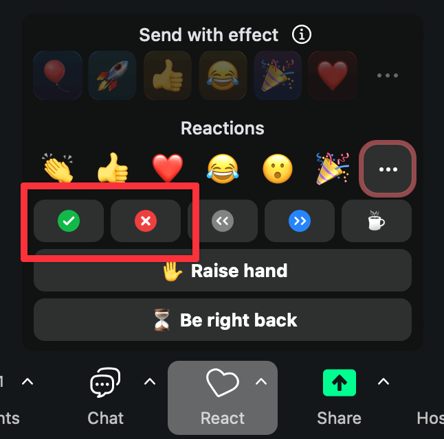

# Welcome! {background-color='' background-image='../../img/background-hex-shapes.svg' background-opacity='0.5'}

## Housekeeping!

::: {.incremental style="font-size: 1.3em;"}

- Be kind and curious!

- Slack and Zoom chat

- Ask questions

:::


## Schedule 

### Day 1

| Time        | Activity                             |
|:------------|:-------------------------------------|
| 10:30–12:30 | Welcome + Intro to conjoint analysis |
| 12:30–13:30 | *Break*                              |
| 13:30–15:00 | Designing conjoint experiments       |

### Day 2

| Time        | Activity                                    |
|:------------|:--------------------------------------------|
| 10:30–12:30 | Conjoint data and causal inference (part 1) |
| 12:30–13:30 | *Break*                                     |
| 13:30–15:00 | Conjoint data and causal inference (part 2) |

## Schedule

### Day 3

| Time        | Activity                                          |
|:------------|:--------------------------------------------------|
| 10:30–12:30 | Conjoint data and respondent preferences (part 1) |
| 12:30–13:30 | *Break*                                           |
| 13:30–15:00 | Conjoint data and respondent preferences (part 2) |

### Day 4

| Time        | Activity                                            |
|:------------|:----------------------------------------------------|
| 10:30–12:30 | Implementing and fielding conjoint surveys (part 1) |
| 12:30–13:30 | *Break*                                             |
| 13:30–15:00 | Implementing and fielding conjoint surveys (part 2) |

## About me

::::: {.columns}
:::: {.column width="50%"}
**Andrew Heiss**

::: {style="font-size: 50%"}
[&ensp;andrewheiss.com](https://www.andrewheiss.com/)&emsp;[&ensp;\@andrew.heiss.phd](https://www.linkedin.com/in/andrewheiss/)

[&ensp;\@andrewheiss](https://github.com/andrewheiss)&emsp;[&ensp; andrewheiss](https://www.linkedin.com/in/andrewheiss/)
:::

- Assistant professor of ~~public policy~~ international relations, ~~Georgia State University~~ Georgetown University in Qatar

- Data visualization, statistics, and causal inference

::::

:::: {.column width="50%"}
{fig-alt="Andrew's headshot" fig-align="center" width=350px}

::::
:::::

## Meeting you where you are

::::: {.columns}
:::: {.column width="48%"}
::: {.fragment .fade-in-then-semi-out}
This course is designed for someone who:

- Is familiar with R (and ideally tidyverse)

- Has some experience with statistical modeling with linear models

- Maybe has an idea for a conjoint experiment
:::
::::

:::: {.column width="4%"}
::::

:::: {.column width="48%"}
::: {.fragment .fade-in}
You'll learn:

- What conjoint analysis is

- How to measure causal effects and explore "product" and "consumer" preferences

- How to design and run your own conjoint experiments
:::
::::
:::::


## Course structure

:::: {.columns}
::: {.column .fragment}
**My turn**

- Lecture segments
- Feel free to just watch, take notes, browse docs, or tinker around with the code
- Lots of live-coding! Most content lives in Quarto files
:::

::: {.column .fragment}
**Your turn**

- Exercises for you to do
- Work on your own or with others
:::
::::

## Bring your own ideas!

::: {.incremental}
- The best way to learn is by building something
- I've given you playground code, but it's fairly basic. *This is by design!*
- You'll have time during the "Your turn"s to to play around and experiment. Try to use these new principles and skills to create something!
:::

## Getting help

:::: {.columns}
::: {.column}



:::

::: {.column}
**Use Zoom reactions**

- []{style="color: #F04F4F"} =<br>"I'm stuck and need help!"

- []{style="color: #11BA48"} =<br>"I finished the exercise"

Ask longer, more detailed questions in Slack

:::
::::

## Your turn {background-color='' background-image='../../img/background-hex-shapes.svg' background-opacity='0.5'}

Introduce yourself:

- Name and professional affiliation
- On a scale of 1–10, how well do you know…
  - R?
  - Tidyverse?
  - Statistical models like OLS, multinomial logit, and Bayesian methods?
  - Conjoint analysis?
- What do you hope to get out of this course?

```{r}
#| echo: false

countdown(minutes = 4)
```
