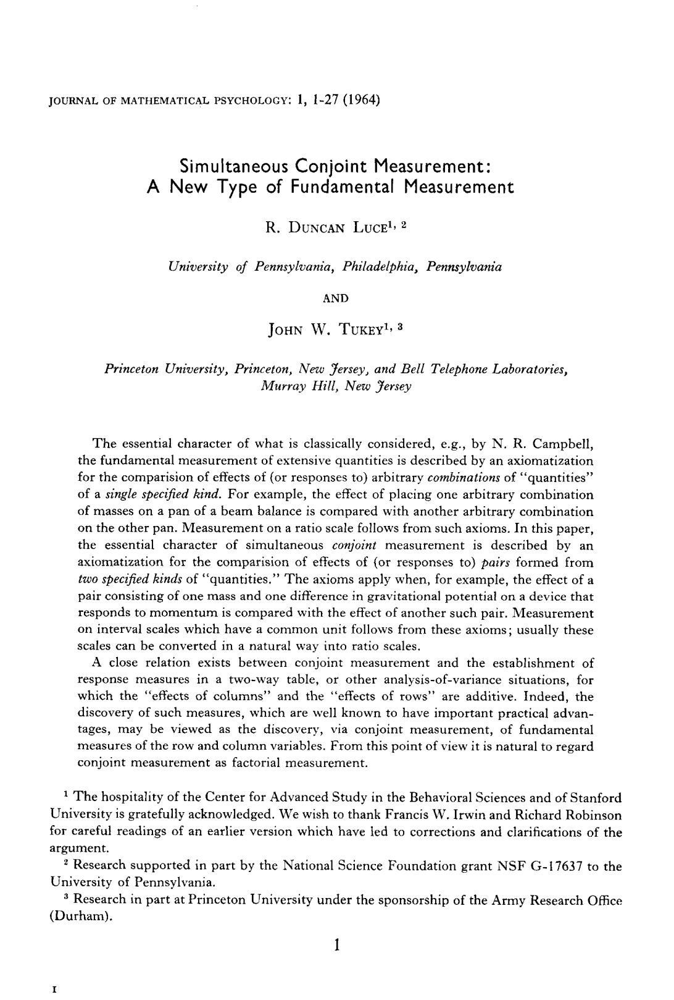
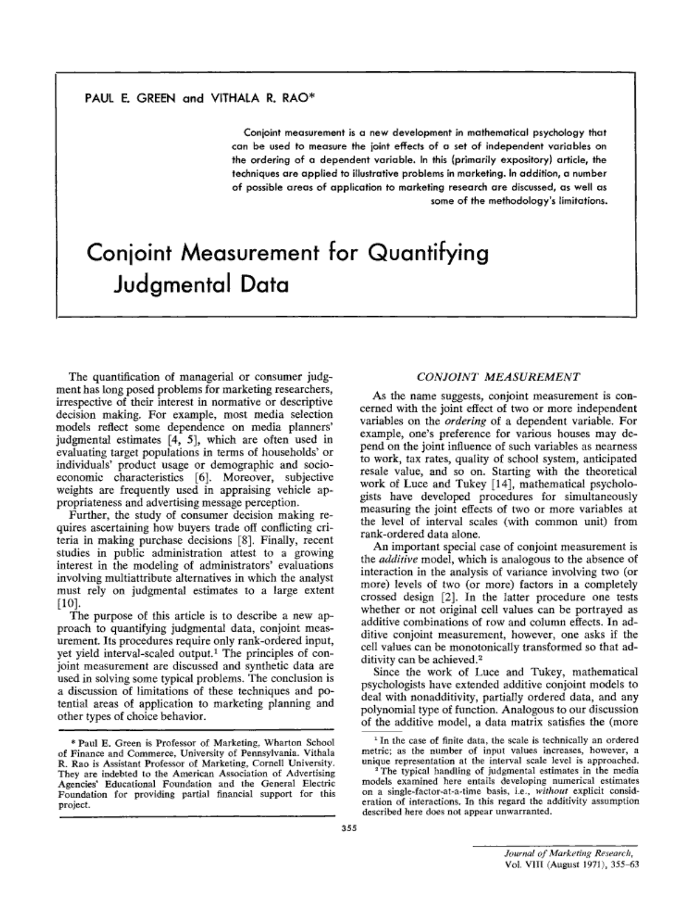
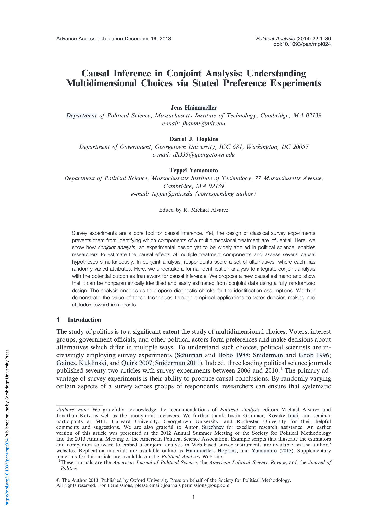
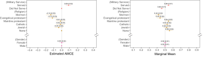

# Where did it come from? {background-color='' background-image='../../img/background-hex-shapes.svg' background-opacity='0.5'}

## Psychology (1960s)

::::: {.columns}

:::: {.column width="65%"}
::: {.text-tiny}
Luce, R. Duncan, and John W. Tukey. 1964. “Simultaneous Conjoint Measurement: A New Type of Fundamental Measurement.” *Journal of Mathematical Psychology* 1 (1): 1–27. <https://doi.org/10.1016/0022-2496(64)90015-X>.
:::

::: {.fragment}
\ 

Originally developed to measure preferences of sets of features
:::

::::

:::: {.column width="35%"}
{style="box-shadow: 5px 5px 15px rgba(0, 0, 0, 0.3); border-radius: 5px;"}
::::

::::::

## Marketing research (1970s)

::::: {.columns}

:::: {.column width="65%"}
::: {.text-tiny}
Green, Paul E., and Vithala R. Rao. 1971. “Conjoint Measurement for Quantifying Judgmental Data.” *Journal of Marketing Research* 8 (3): 355. <https://doi.org/10.2307/3149575>.
:::

::: {.fragment}
Adapted to answer marketing questions:

- How should we price our product?
- Which features should we invest in?
- What product will maximize market share?

Uses: consumer electronics, airlines, credit cards, pharmaceuticals, automobiles
:::

::::

:::: {.column width="35%"}
{style="box-shadow: 5px 5px 15px rgba(0, 0, 0, 0.3); border-radius: 5px;"}
::::

::::::

## Apple vs. Samsung (2012)

::: {.incremental}
- Apple sued Samsung for patent infringement: copied features like sliding to unlock, search, autocorrect, pinch-to-zoom, etc.
- Apple hired MIT marketing professor [John Hauser](https://mitmgmtfaculty.mit.edu/jhauser/) to measure value of those features
- Conjoint experiment analyzed with a hierarchical Bayesian model
- Consumers would be willing to spend between \$32--\$102 extra for these features
- These results (and other bits of evidence) scaled up to \$2 billion in damages awarded to Apple
:::

## Causal inference (2010s)

::::: {.columns}

:::: {.column width="65%"}
::: {.text-tiny}
Hainmueller, Jens, Daniel J. Hopkins, and Teppei Yamamoto. 2014. “Causal Inference in Conjoint Analysis: Understanding Multidimensional Choices via Stated Preference Experiments.” *Political Analysis* 22 (1): 1–30. <https://doi.org/10.1093/pan/mpt024>.
:::

::: {.fragment}
**Instead of analyzing a whole constellation of attributes, look at specific levers individually.**
:::

::: {.fragment}
Conjoints are like RCTs, just fancier. 

Since treatment assignment is random, we can find the effect on the selection of probability (or favorability) when changing an attribute.

Uses: Measure effects of political candidate characteristics, issue salience, organization characteristics
:::

::::

:::: {.column width="35%"}
{style="box-shadow: 5px 5px 15px rgba(0, 0, 0, 0.3); border-radius: 5px;"}
::::

::::::

## {.r-stretch .center}

{fig-align="center" width="100%" style="box-shadow: 5px 5px 15px rgba(0, 0, 0, 0.3); border-radius: 5px;"}
